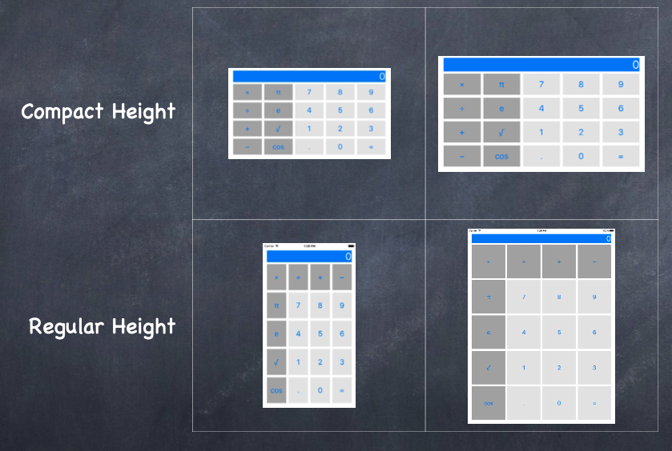

# Pursuit-Core-iOS-Advanced-Auto-Layout-Lab

The following is from [Paul Hegarty Stanford iOS Course](http://web.stanford.edu/class/cs193p/cgi-bin/drupal/).

Build the UI for a calculator.  It's button layout should change depending on the size class of the device, as shown below:

